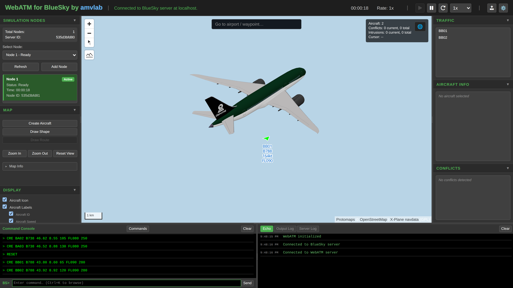
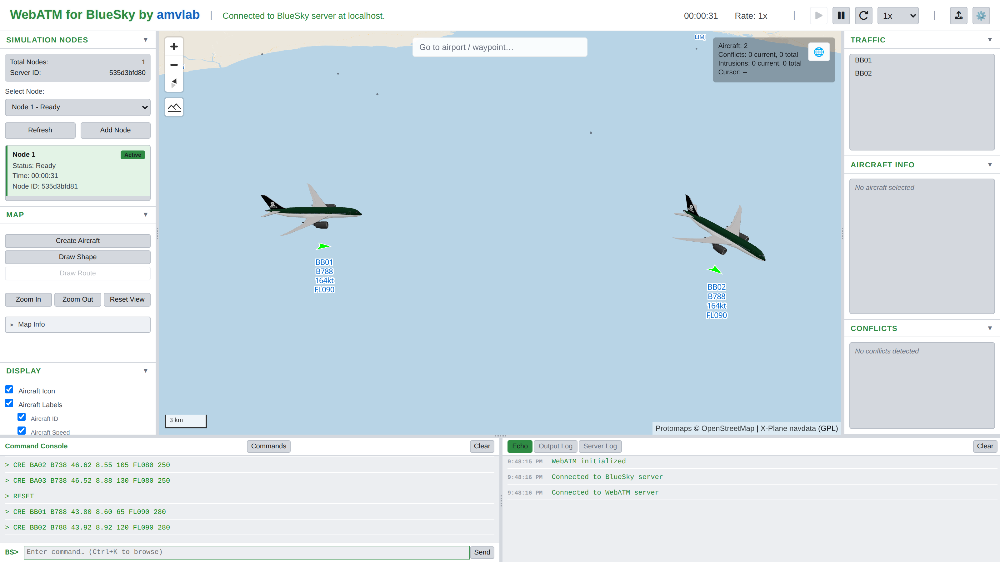
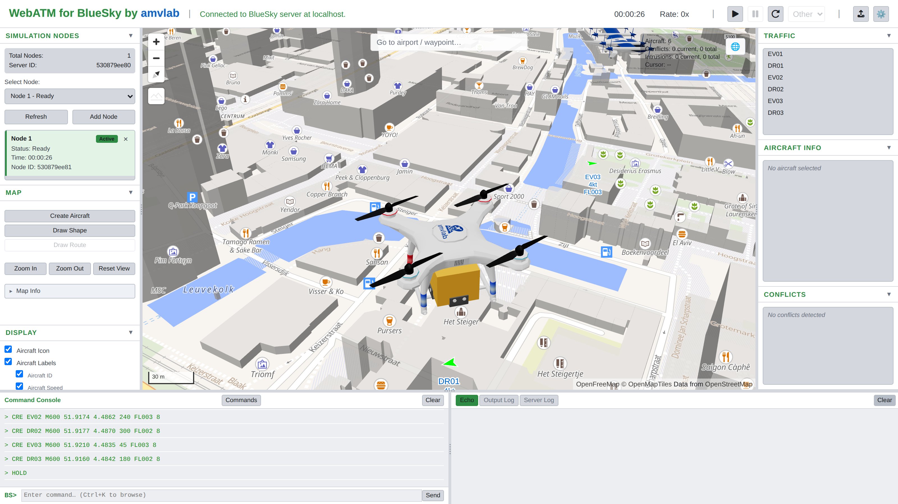
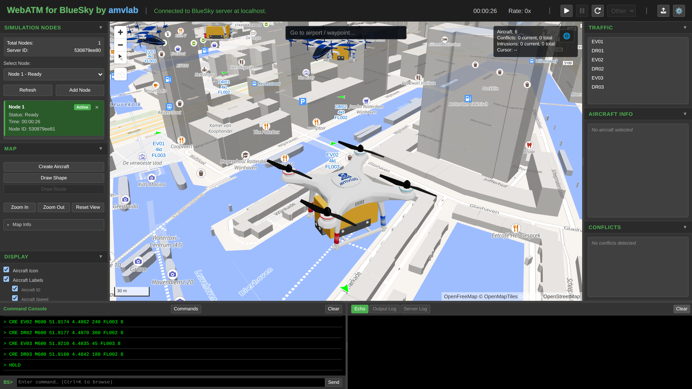
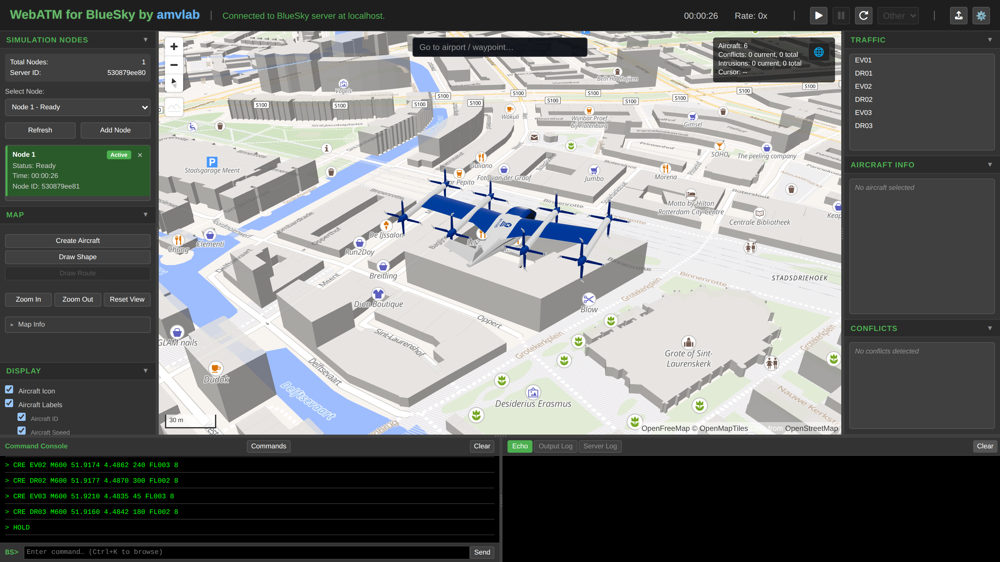

# amvlab 3d Aircraft Models
Open source 3D aircraft models in `.GLB` format optimised for air traffic simulators, including airliners, an eVTOL, and a drone. Each model ships with a plain, logo-free variant.

## Gallery

### A320

### A350

### A380

### B737

### B787

### Drone

### EVTOL

## License

The models and images in this repository are licensed under [Creative Commons Attribution 4.0 International (CC BY 4.0)](https://creativecommons.org/licenses/by/4.0/).

You are free to share and adapt the material for any purpose, including commercially, as long as you give appropriate credit, provide a link to the license, and indicate if changes were made.
